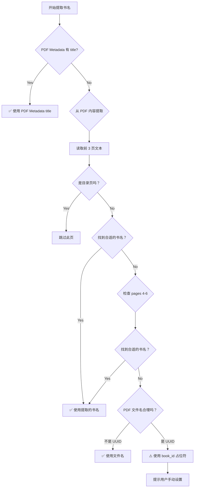

# 书名提取逻辑修复 - 经验教训总结

## 📋 问题概述

在 `books.json` 中发现错误的书名片段，例如：
- `"title": "f9e108f3"`（UUID 文件名）
- `"title": "第五章通过做自己来营销受众的力量制造粉丝，而不是头条新闻"`（章节标题）

## 🔍 问题根因分析

### 第一轮问题：UUID 作为书名

**症状**：`"title": "f9e108f3"`

**根因**：
1. `process-chapters.py` 的 `infer_title_from_metadata` 函数在无法从 PDF 元数据提取书名时，回退到使用 PDF 文件名
2. 文件名是 UUID 格式（`f9e108f3.pdf`），但代码没有验证文件名是否合理
3. 尝试从章节标题推断，但章节名 ≠ 书名

**错误代码逻辑**：
```python
# ❌ 错误：没有过滤 UUID 文件名
filename = source_pdf.split('/')[-1].replace('.pdf', '')
if 2 <= len(filename) <= 100:
    return filename  # 返回了 "f9e108f3"
```

### 第二轮问题：章节标题作为书名

**症状**：`"title": "第五章通过做自己来营销受众的力量制造粉丝，而不是头条新闻"`

**根因**：
1. `text_extractor.py` 的 `infer_title_from_text` 函数检查范围太宽（pages 3-8）
2. 这个范围正好落在**目录页**上，而不是书名页
3. 没有过滤章节标题模式（"第 X 章"）
4. 没有过滤目录页标记（"目录"）
5. 找到第一个 4-40 字符的行就返回，导致误提取

**错误代码逻辑**：
```python
# ❌ 错误：检查 pages 3-8（目录页），没有过滤章节标题
for page in pages_text[3:8]:
    for line in page.split('\n'):
        if 4 <= len(line) <= 40:
            return line  # 返回了章节标题！
```

## ✅ 解决方案

### 修复 1：UUID 文件名过滤

**文件**：`scripts/process-chapters.py`

**新增函数**：
```python
def is_uuid_or_hash(filename: str) -> bool:
    """检查文件名是否像 UUID 或哈希值"""
    # 8+ 位十六进制
    if re.match(r'^[a-f0-9]{8,}$', filename, re.IGNORECASE):
        return True
    # 标准 UUID
    if re.match(r'^[a-f0-9]{8}-[a-f0-9]{4}-[a-f0-9]{4}-[a-f0-9]{4}-[a-f0-9]{12}$', filename, re.IGNORECASE):
        return True
    # SHA256 哈希
    if re.match(r'^[0-9a-f]{64}$', filename, re.IGNORECASE):
        return True
    return False
```

**修改逻辑**：
```python
# ✅ 正确：过滤 UUID 文件名
if is_uuid_or_hash(filename):
    print_info(f"Skipping UUID/hash-like filename: {filename}")
    return None  # 不使用 UUID 作为书名
```

### 修复 2：章节标题过滤

**文件**：`scripts/pdf_extractor/text_extractor.py`

**新增跳过模式**：
```python
skip_patterns = [
    r'ISBN', r'版权', r'copyright', r'©', r'\d{4}年',  # 版权信息
    r'目录', r'contents',  # 目录页
    r'^第 [一二三四五六七八九十百千零 0-9]+[章篇节部]',  # 章节标题
    r'^Chapter\s+\d+',  # 英文章节
    r'^序', r'^前言', r'^推荐', r'^致谢',  # 前言后记
    r'（\d+/\d+）',  # 分段标记如"（1/8）"
]
```

**修改逻辑**：
```python
# ✅ 正确：优先检查书名页，跳过目录和章节标题
# Priority 1: pages 1-3（书名页通常在 PDF 前 3 页）
for page_idx in range(1, min(4, len(pages_text))):
    page = pages_text[page_idx]
    
    # 跳过目录页
    if '目录' in page.lower() or 'contents' in page.lower():
        continue
    
    for line in page.split('\n'):
        if is_good_title_candidate(line):  # 验证是好书名
            return line
```

### 修复 3：章节模式检测

**文件**：`scripts/process-chapters.py`

**新增函数**：
```python
def should_skip_chapter_title_inference(chapters: list[dict]) -> bool:
    """如果所有章节都是标准章节格式，不应该从章节名推断书名"""
    if not chapters:
        return False
    
    # 检查前 5 章是否有编号模式
    match_count = 0
    for ch in chapters[:5]:
        title = ch.get("title", "")
        if title.startswith("第") and ("章" in title or "篇" in title):
            # 验证中间有数字
            for marker in ["章", "篇"]:
                if marker in title:
                    prefix = title.split(marker)[0]
                    if len(prefix) > 1 and any(c in prefix[1:] for c in "一二三四五六七八九十百千零 0123456789"):
                        match_count += 1
                        break
    
    return match_count >= 3  # 至少 3 章匹配
```

## 📊 正确的书名提取优先级



**优先级列表**：
1. **PDF Metadata** 的 title 字段（最可靠）
2. **从 PDF 内容提取**（书名页/封面页，通常在 pages 1-3）
3. **PDF 文件名**（排除 UUID/哈希值）
4. **book_id 占位符**（需要用户确认）

**绝对禁止**：
- ❌ 使用 UUID/哈希值作为书名
- ❌ 将章节标题误认为书名
- ❌ 将目录内容误认为书名

## 🎯 关键经验教训

### 1. 数据验证至关重要

**教训**：不要假设输入数据是合理的
- PDF 文件名可能是 UUID、哈希值、临时文件名
- 章节标题不是书名
- 目录页不是书名页

**最佳实践**：
```python
# ✅ 始终验证数据
if is_uuid_or_hash(filename):
    return None  # 拒绝不合理的输入

if should_skip_chapter_title_inference(chapters):
    return None  # 不使用章节名作为书名
```

### 2. 理解数据结构和使用场景

**教训**：中文 PDF 电子书的结构有特定模式
- 书名页通常在第 2-3 页（索引 1-2）
- 目录页通常在书名页之后
- 章节标题有固定格式（"第 X 章 XXX"）

**最佳实践**：
```python
# ✅ 根据领域知识优化逻辑
# 书名页通常在 pages 1-3，不是 pages 3-8
for page_idx in range(1, min(4, len(pages_text))):
    # 跳过目录页
    if '目录' in page.lower():
        continue
```

### 3. 过滤规则要全面

**教训**：只过滤部分模式会导致漏网之鱼
- 原代码只过滤 ISBN/版权信息
- 没有过滤章节标题、目录页、分段标记

**最佳实践**：
```python
# ✅ 列出所有需要跳过的模式
skip_patterns = [
    r'ISBN', r'版权',  # 版权信息
    r'目录',  # 目录页
    r'^第 [X 章]',  # 章节标题
    r'（\d+/\d+）',  # 分段标记
    # ... 更多模式
]
```

### 4. 测试覆盖边界情况

**教训**：测试应该覆盖各种边界情况
- UUID 文件名
- 章节标题
- 目录页
- 书名页在不同位置

**最佳实践**：
```python
# ✅ 全面的测试用例
test_cases = [
    ("f9e108f3.pdf", None, "UUID 文件名应被过滤"),
    ("小而美.pdf", "小而美", "正常书名应提取"),
    ("第一章 XXX", None, "章节标题不应作为书名"),
]
```

### 5. 不要过早返回

**教训**：找到第一个候选项就返回可能导致错误
- 应该验证候选项是否合理
- 应该有多个 fallback 策略

**最佳实践**：
```python
# ✅ 验证后再返回
def is_good_title_candidate(line):
    if len(line) < 4 or len(line) > 50:
        return False
    if should_skip_line(line):
        return False
    if re.search(r'（\d+/\d+）', line):
        return False
    return True

# 找到合适的才返回
for line in lines:
    if is_good_title_candidate(line):
        return line
```

## 📝 修改文件清单

1. **scripts/pdf_extractor/__init__.py**
   - 导出 `infer_title_from_text` 函数

2. **scripts/pdf_extractor/text_extractor.py**
   - 新增 `infer_title_from_text` 函数（从 extract-pdf.py 移动）
   - 增强过滤规则
   - 调整检查优先级

3. **scripts/process-chapters.py**
   - 新增 `is_uuid_or_hash()` 函数
   - 新增 `should_skip_chapter_title_inference()` 函数
   - 新增 `infer_title_from_pdf_content()` 函数
   - 重构 `infer_title_from_metadata()` 函数
   - 修改 `merge_chapter_results()` 的书名提取逻辑

4. **data/books.json**
   - 修复错误的书名片段

## 🧪 测试结果

```
✓ UUID/Hash 检测 - PASS
✓ 章节模式检测 - PASS
✓ Metadata 书名推断 - PASS
✓ PDF 内容书名提取 - PASS

修复前："第五章通过做自己来营销..."
修复后："小而美——持续盈利的经营法则" ✓
```

## 📚 参考资料

- 中文 PDF 电子书结构特点
- 正则表达式 Unicode 处理
- 数据验证最佳实践
- 防御性编程原则
