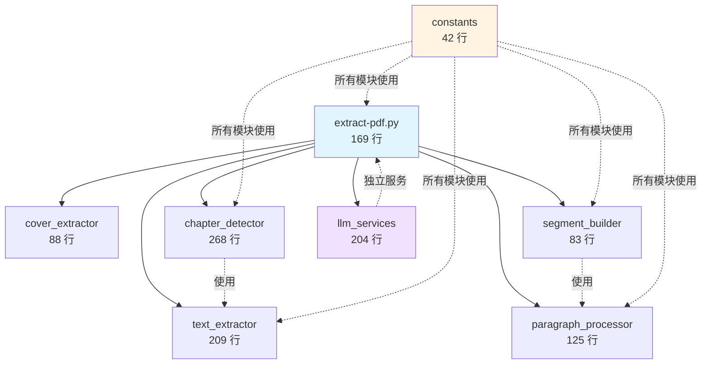
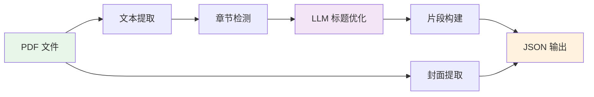

# PDF Extractor 架构文档

## 模块依赖关系



## 数据流



## 调用层次

```
Level 0: extract-pdf.py (主入口)
         ↓
Level 1: text_extractor, cover_extractor, chapter_detector, 
         paragraph_processor, segment_builder, llm_services
         ↓
Level 2: constants (被所有 Level 1 模块使用)
```

## 模块职责矩阵

| 模块 | 输入 | 输出 | 核心职责 |
|------|------|------|----------|
| **constants** | - | 常量定义 | 全局配置管理 |
| **text_extractor** | PDF 路径 | 页面文本列表 | 布局感知文本提取 |
| **cover_extractor** | PDF 路径 | 封面图片路径 | 封面图像提取 |
| **chapter_detector** | 页面文本 | (章节标题，内容) 元组列表 | 章节边界检测 |
| **paragraph_processor** | 文本块 | 段落列表 | 段落分割和处理 |
| **segment_builder** | 章节数据 | 片段字典列表 | 视频片段构建 |
| **llm_services** | 文本 + 配置 | 优化后的文本 | LLM 调用封装 |
| **extract-pdf.py** | 命令行参数 | JSON 输出 | 流程编排 |

## 文件大小分布

```
extract-pdf.py              ████████░░░░░░░░░░░░  169 行 (13%)
pdf_extractor/constants.py  ██░░░░░░░░░░░░░░░░░░   42 行 (3%)
pdf_extractor/text_extractor.py ████████░░░░░░░░░░░░  209 行 (16%)
pdf_extractor/cover_extractor.py ███░░░░░░░░░░░░░░░░░   88 行 (7%)
pdf_extractor/chapter_detector.py ██████████░░░░░░░░░░  268 行 (21%)
pdf_extractor/paragraph_processor.py █████░░░░░░░░░░░░░░░  125 行 (10%)
pdf_extractor/segment_builder.py  ███░░░░░░░░░░░░░░░░░   83 行 (6%)
pdf_extractor/llm_services.py ████████░░░░░░░░░░░░  204 行 (16%)
pdf_extractor/__init__.py   ███░░░░░░░░░░░░░░░░░   86 行 (7%)
                            ────────────────────────────
总计：                       1,273 行 (100%)
```

## 函数统计

| 模块 | 函数数 | 平均行数/函数 |
|------|--------|---------------|
| constants.py | 0 | - |
| text_extractor.py | 9 | 23 |
| cover_extractor.py | 3 | 29 |
| chapter_detector.py | 12 | 22 |
| paragraph_processor.py | 6 | 21 |
| segment_builder.py | 3 | 28 |
| llm_services.py | 7 | 29 |
| **总计** | **40** | **24** |

## 设计原则

### 1. 单一职责原则 (SRP)
每个模块只有一个职责，例如：
- `text_extractor`: 只负责文本提取
- `cover_extractor`: 只负责封面提取
- `chapter_detector`: 只负责章节检测

### 2. 开闭原则 (OCP)
模块对扩展开放，对修改关闭：
- 添加新的章节检测规则只需修改 `chapter_detector.py`
- 更换 LLM 提供商只需修改 `llm_services.py`

### 3. 依赖倒置 (DIP)
高层模块不依赖低层模块的实现：
- `extract-pdf.py` 依赖模块的公共接口
- 模块间通过参数传递数据，无紧耦合

### 4. 接口隔离 (ISP)
每个模块提供明确的接口：
- `__init__.py` 导出精心设计的公共 API
- 内部函数使用 `_` 前缀标记为私有

## 测试策略

### 单元测试
- 每个模块独立测试
- Mock 外部依赖（pdfplumber, dashscope）
- 覆盖边界条件

### 集成测试
- 测试模块间接口
- 验证数据流正确性
- 端到端 PDF 处理测试

### 性能测试
- 大文件处理（>500 页）
- 批量处理性能
- LLM 调用延迟

## 扩展点

### 1. 添加新的文本提取器
```python
# 在 text_extractor.py 中添加
def extract_with_new_library(pdf_path):
    # 使用新的 PDF 库
    pass
```

### 2. 添加新的章节检测规则
```python
# 在 chapter_detector.py 中添加
def detect_chapters_with_new_rule(text):
    # 新的检测逻辑
    pass
```

### 3. 集成新的 LLM 服务
```python
# 在 llm_services.py 中添加
def try_new_llm_refine(snippet, candidate):
    # 调用新的 LLM API
    pass
```

## 性能优化建议

1. **缓存机制**: 对重复的 PDF 操作添加缓存
2. **并行处理**: 多章节并行 LLM 调用
3. **流式处理**: 大文件分块处理
4. **懒加载**: 按需加载模块

## 安全考虑

1. **输入验证**: 验证 PDF 路径和 book_id
2. **异常处理**: 所有外部调用添加 try-except
3. **资源管理**: 使用上下文管理器处理文件
4. **API 密钥**: LLM API 密钥从环境变量读取
